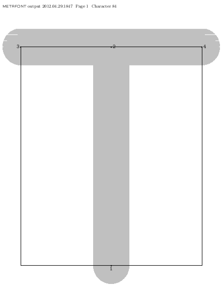

********
Tutoriel
********

.. todo::
    Finir de rédiger le tutoriel !

Installation
============

:Système d'exploitation:
  `GNU/Linux <http://fr.wikipedia.org/wiki/Linux>`_ recommandé

Sous Ubuntu :
  sudo apt-get install texlive-binaries

Un premier caractère
====================

Je vous propose de passer directement à la pratique :
voir le rendu d'un fichier de code MetaFont,
puis comprendre point par point son contenu.

#. Enregistrez les lignes suivantes dans un fichier
   texte nommé ``T_basic.mf`` :

     .. literalinclude:: T_basic.mf
#. Compilez le fichier avec le programme MetaFont :

     ``mf T_basic.mf``

   Cela permet de générer un fichier ``T_basic.2602gf``.
   Il s'agit d'un fichier de fonte TeX,
   utilisable uniquement par TeX et ses variantes.

#. Convertissez le fichier ``T_basic.2602gf`` en
   `DVI <http://fr.wikipedia.org/wiki/DVI_(TeX)>`_ :

     ``gftodvi T_basic.2602gf``

   Le fichier ainsi généré peut être ouvert
   avec *evince*.

Le résultat devrait ressembler à ceci :

Les petits défauts d'affichage sont sans importance.
Comme je l'expliquais dans le paragraphe
:ref:`conversions`, il s'agit d'un caractère matriciel.
L'approximation qu'en fait *evince* est donc imparfaite.
Ces défauts disparaîtront avec la conversion en fonte.
